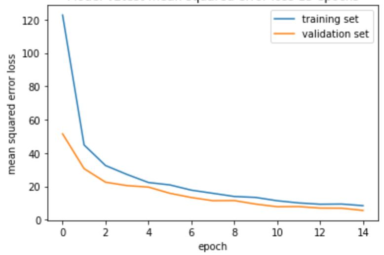
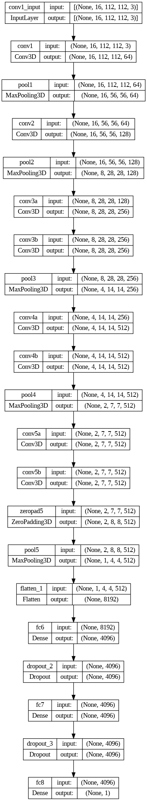

# Vision-based Vehicle Speed Estimation

CIVIL-459 Final Project: Vision-based Vehicle Speed Estimation

This work is a part of ”Building AV Autopilot” Project of CIVIL-459 course at EPFL.

This work is aim to solve this problem by estimating the ego vehicle speed using only frames from a single front-facing monocular camera with a mask of the lane to preserve spatiotemporal features as input and receive high performance of vehicle speed estimation as output.

## Result

https://github.com/vita-student-projects/vision-based_vehicle_speed_estimation_gr26/assets/99803920/ae21e893-207d-4c84-a186-b83329f63e8c

Note that this is the result when the network is purely trained on comma.ai data and tested on train.mp3 data with completely different lighting conditions and different scene dynamics. Most of the error on the train.mp3 footage occurs at the turns, which is limitedly seen in comma.ai [https://www.comma.ai]  dataset

## Validation Loss during train model

 Mean Square Error loss of train and validation dataset

In this particular project, we have chosen to utilize the **Mean Squared Error (MSE)** as our loss function. The reason behind this choice stems from the nature of our task, which involves predicting the speed. In this context, speed prediction is considered a regression problem, where the goal is to estimate a continuous value rather than a categorical or discrete outcome.

**Result** : By achieving an MSE of around 5 across the validation sets, we can have increased confidence in the reliability of our speed prediction system, as it demonstrates a relatively small average deviation from the true speed values.
## Usage:

    ego-vehicle-speed-estimation
    |
    |____data
    |      |
    |      |____weights.h5              - wights of the final model (3D CNN)
    |      |
    |      |____c3d-sports1M_weights.h5 - wights of the pre-trained 3DCNN model on "SportM1" datas
    |      |
    |      |____test.mp4                - test video
    |      |
    |      |____train.mp4               - train video
    |      |
    |      |____test_pred.txt           - model prediction of test data
    |
    |____Speed_Estimation.ipynb         - final pipeline (includes 3D CNN)
    |
    |____Speed_Estimation_v1.0.ipynb    - pipeline with more debug details
    |
    |____labels.txt                     - ground truth of train data (train.mp4).
    |
    |____cnn_network.png                - architecture of 3DCNN model
    |
    |____requirements.txt               - required libraries
    |
    |____mse_loss.png                   - graphic of mse loss on train and validation data

    

## Dataset

DataSet used  in this work was reuqired from the speed prediction challenge posted by https://comma.ai/. The available of this data set can find on comma.ai website [https://goo.gl/ERi7Uh]. This Dataset consists of 17 minuntes video (**train.mp4**) from a single front-facing monocular camera from Hyundai Sonata and labels (**labels.txt**) for each frame. In nutshell, this DataSet has 20400 frames which each frame has value of speed as label.

## Piplines

1. Download the weights pretrained on the Sports-1M dataset [https://goo.gl/tsEUo2] or find it in **data**-->**c3d-sports1M_weights.h5**  - wights of the pre-trained 3DCNN model on "SportM1" datas
          
2. Download the training data from comma.ai website [https://goo.gl/ERi7Uh] or find it in **data**-->**train.mp4** and **test.mp4**; **labels.txt** - ground truth of train data (train.mp4) 

3. Download the final weights of 3D CNN model to repoduce result **data**-->**weights.h5** - wights of the final model (3D CNN)

4. Download the file **requirements.txt** with required libraries to run notebooks

5. Follow the steps in **Speed_Estimation.ipynb** to reproduce result

6. Follow the steps in **Speed_Estimation_v1.0.ipynb** for a walk-through of the training and testing of the network

          

## The Best Model: 3D CNN Architecture

The architecture of best model: 3D CNN

The 3D Convolutional Neural Network (CNN) architecture is our best model for video analysis and processing. It excels at capturing both spatial and temporal information, enabling it to understand complex motion dynamics and learn fine-grained patterns. The 3D CNN's enhanced feature extraction and robustness to spatio-temporal variations make it highly effective in tasks such as speed prediction. Our model is  related on **2022 state-of-the-art work "Ego Vehicle Speed Estimation using 3D Convolution with Masked Attention”** by Mathew, A.M. and Khalid,T. [https://arxiv.org/pdf/2212.05432.pdf]. Additionally, the availability of the pretrained model on "SportM1" dataset allows for efficient transfer learning, leading to improved performance even with limited training data.

## Contributions:
